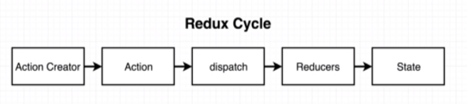
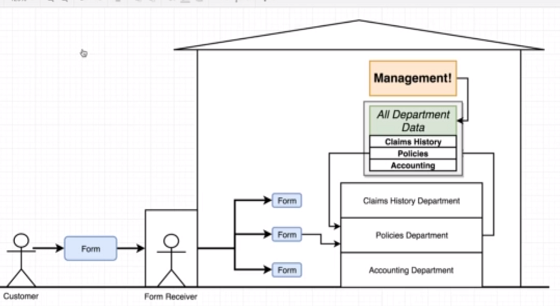
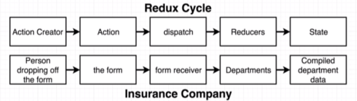
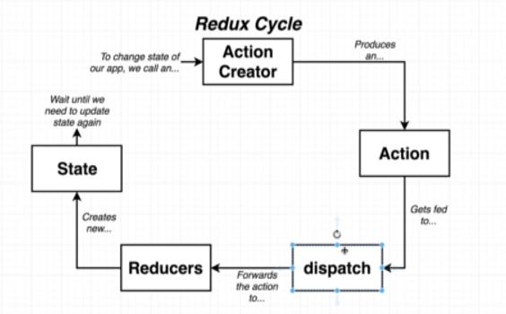

# Section 11 - Redux




**An analogy: an Insurance Company**



**How the redux cycle maps to the insurance process analogy**



* **Action Creator** - a function that will return a JS object.
* **Action** - The JS object returned by an **action creator** that has a `type` and `payload` property. Describes the change we want to make to our data.
    - The `type` property describes the type of change we want to make to our data. In the insurance analogy, the type would be *claim* or *policy*.
    - The `payload` property describes the context around the change we want to make. In the insurance analogy, the payload would be the *customer details* and *cash amount*.
* **Dispatch** - a function that makes copies of the action and passes it off to different parts of our application. *Part of the redux library itself, we don't need to write it ourselves.*
* **Reducer** - A function responsible for taking in an *action* and some *existing data*, then returning some *processed data* to a *centralized location*.
* **State** - Central repository of all information created by reducers.

**The Redux Cycle**
--------------------


## Code demonstrating Redux basics
===================================

```javascript
console.clear();

//People dropping off a form - action creators/action
const createPolicy = (name, amount) => {
  return {
    type: 'CREATE_POLICY',
    payload: {
      name: name,
      cash: amount
    }
  };
};

const deletePolicy = (name) => {
  return {
    type: 'DELETE_POLICY',
    payload: {
      name: name
    }
  };
};

const createClaim = (name, amountOfMoneyToCollect) => {
  return {
    type: 'CREATE_CLAIM',
    payload: {
      name: name,
      amountOfMoneyToCollect: amountOfMoneyToCollect
    }
  };
};

//Reducers - departments!

// If oldClaimsList is undefined, it will have [] as its default
const claimsHistory = (oldClaimsList = [], action) => {
  if (action.type === 'CREATE_CLAIM') {
    return [... oldClaimsList, action.payload];
    // The ... syntax is ES2015 for creating concatenating two arrays into a brand new single array (not a list of arrays)
    // We do not want to mutate objects in reducers!!!
  } else {
    return oldClaimsList;
  }
};

const accounting = (bagOfMoney = 100, action) => {
  if (action.type === 'CREATE_CLAIM') {
    return bagOfMoney - action.payload.amountOfMoneyToCollect;
  } else if (action.type === 'CREATE_POLICY') {
    return bagOfMoney + action.payload.cash;
  } else {
    return bagOfMoney
  }
};

const policies = (policyList = [], action) => {
  if (action.type === 'CREATE_POLICY') {
    return [...policyList, action.payload.name];
  } else if (action.type === 'DELETE_POLICY') {
    return policyList.filter((name) => name !== action.payload.name);
  } else {
    return policyList;
  }
}

const {createStore, combineReducers} = Redux;

const ourDepartments = combineReducers({
  accounting: accounting,
  claimsHistory: claimsHistory,
  policies: policies
});

const store = createStore(ourDepartments);

store.dispatch(createPolicy("alex", 20));
store.dispatch(createPolicy("jim", 80));
store.dispatch(createPolicy("time", 40));

store.dispatch(deletePolicy("alex"));

store.dispatch(createClaim("jim", 40));
store.dispatch(createClaim("tim", 30));

console.log(store.getState());

```