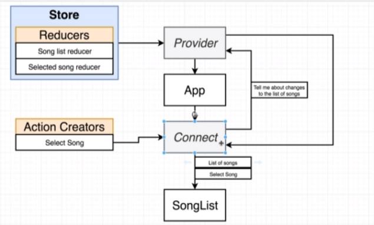
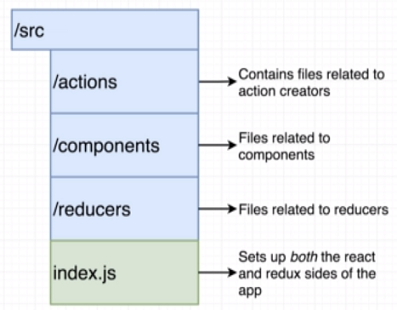
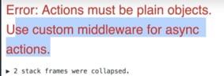
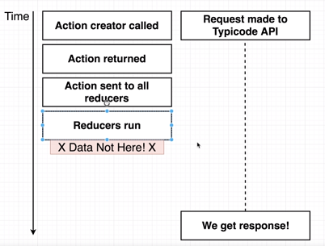
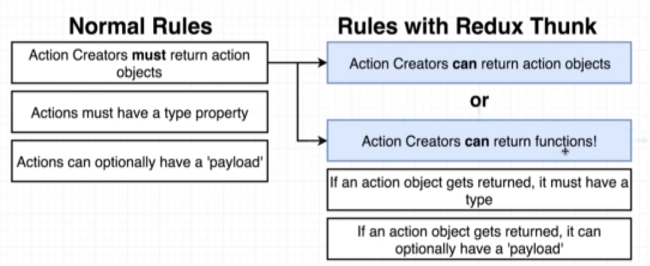
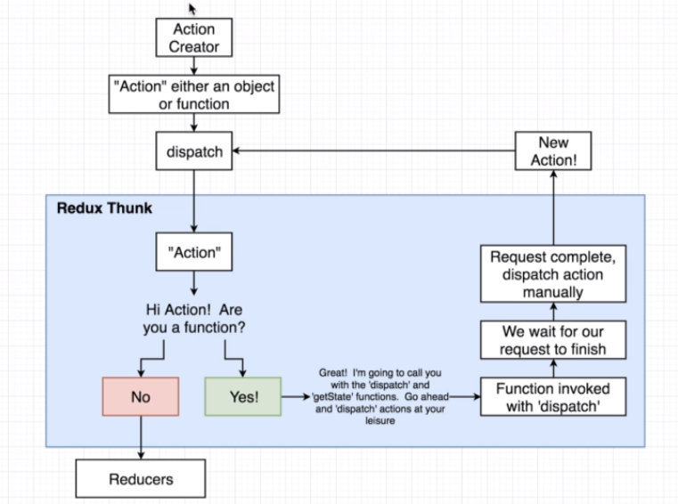
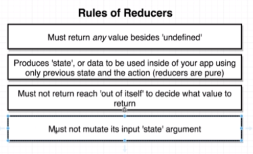
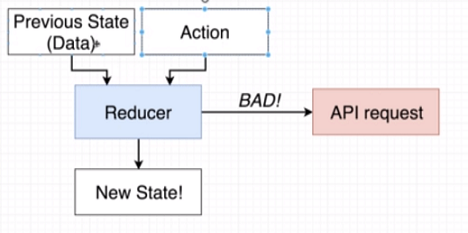
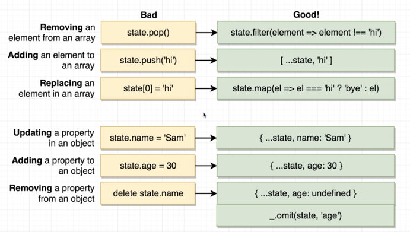

# Section 12 - 15

How React-Redux works



How to organize React-Redux project directory



General Flow for loading API Data using Redux


**Avoid making API Calls in Action Creators like this:**

```javascript
import jsonPlaceholder from '../apis/jsonPlaceholder';

export const fetchPosts = async  () => {
    const response = await jsonPlaceholder.get('/posts');
    
    return ({
        type: 'FETCH_POSTS'
    });
};
```

If you wrote code like that, you would get the following error:



There are two things wrong with the code above:
1. Action creators must return `plain JS objects` (with a type property). Since we're using ES2015 code with async/await, a plain object is not necessarily returned.
2. By the time the action creator gets to a reducer, it won't have fetched the data!

**Why you can't use promises in the action creator:**



*This is where `redux-thunk` comes in!*


* All this time we've been working with synchronous action creators. We now need to work with **asynchronous action creators**, which take some time for its data to be ready for use.
* You need to install middleware to make use of async action creators.






## Redux Store Design

Rules of Reducers



* **Rule 1**: You can't return `undefined`, but you can return `null`!
* **Rule 2**: Reducers must be *immutable* (no mutation involving state should take place): new-state = old-state + action. However on the first call of a reducer, it's fine to give a default value to the initial (i.e. old) state.
* **Rule 3**: Should only base its processing based on action and old state data. No mutation should take place within the function (printing to screen, changing the DOM, etc). Example of impure reducer:



* **Rule 4**: Reducer functions need to be pure, state objects should be immutable *even though you can mutate the state object!*. **You will not receive any error messages if you mutate the state object, because Redux simply discards any state mutations because it checks for changes in object reference for state changes (so if you return a new object, it detects the change in state, while if you mutate a state object and return it, Redux simply returns the old state it holds).**



## Memoizing Functions

* Go to lodash.com for a JavaScript utility library.
* One of Lodash's functions, is a function wrapper called `memoize`. What it does is that it caches the result of an argument, so we can avoid making repeated network requests/processing for the same argument!


E.g.:
```javascript
function getUser(userId) {
    response = fetch(userId);
    return response;
}

memoizedGetUser = memoize(getUser);
```