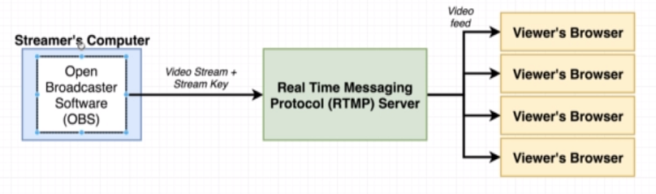
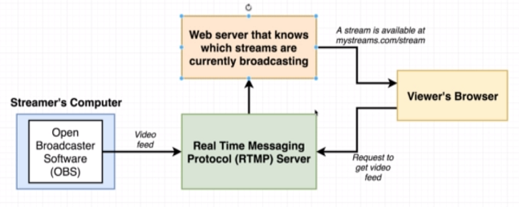
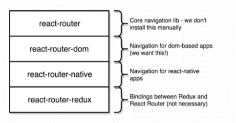
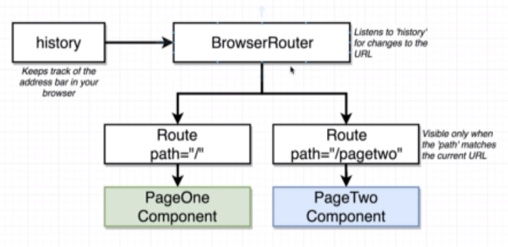
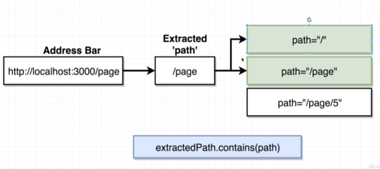
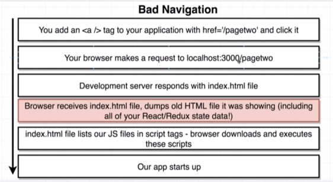
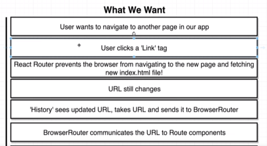
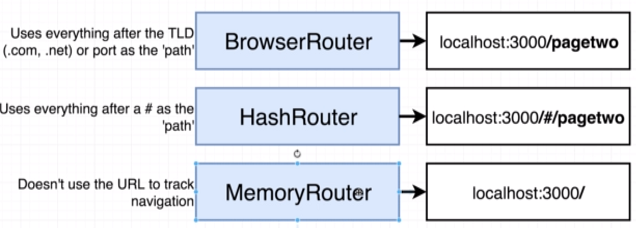
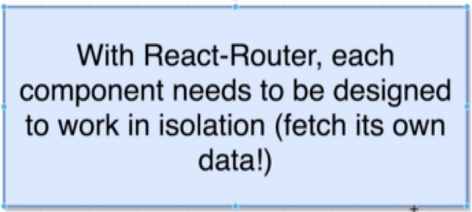

# Section 16 - React Router

**How Video Streaming Generally Works**

**React Router Dependencies**

**The Browser Router**

* Multiple components can match to the same route!
* When multiple components are assigned to the same route, they will both be rendered on to the page.
* When you **do not use the *exact*** keyword in the path, React-Router can end up showing multiple components which have different paths. This is because of the rule by which React-Router operates. It iterates through all available paths, and checks if the **user path *contains* the selected path**. All paths that match, will have their components rendered on screen. E.g:

* If you use *exact*, instead of a **contains** check, an **equality** check is used.
* Why you should never use `<a href="..">` for navigation in a react app:

* Instead of `<a href>`, use `import {Link} from 'react-router-dom` and `<Link to="/pagetwo">`.

## Additional React Router Info

* There are actually **3 types** of React Routers:

* With a HashRouter, React-Router will only manipulate the link portion after the `#` during navigation because that's all it cares about.
* With a MemoryRouter, the *link does not change with navigation*!
* **BrowserRouter** is the most complex to deploy, because in a traditional webserver, whenever a link to a resource that doesn't exist is supplied, the server responds with a 404 error. The Create-React-App dev server, responds with the default index.html file, and the bundle.js will then handle that resource request for you. To customize that non-standard behaviour in a traditional webserver (which isn't setup for a single page webapp) is not straightforward.
* When **HashRouter** is used, the browser only contacts the webserver for the default page (it discards the hash). 

* **When you refresh a page, or visit a link with state, you will lose all state information!**
