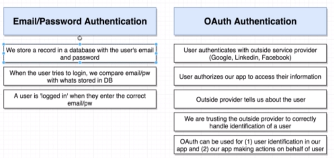
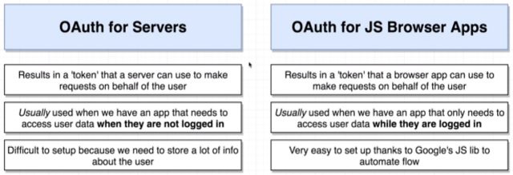
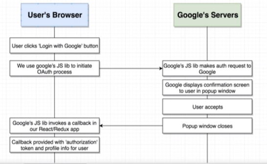
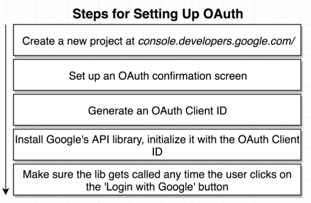

# Section 17 - OAuth Authentication

**How OAuth Generally Works**

* Example of using the OAuth for Servers flow: a mail application that deletes spam every 10 minutes - user being logged in is not guaranteed.
* OAuth for JS Browser Apps - good for when you only want to use when a user is logged in.

* Visit https://developers.google.com/api-client-library/javascript/reference/referencedocs
