# REST Conventions

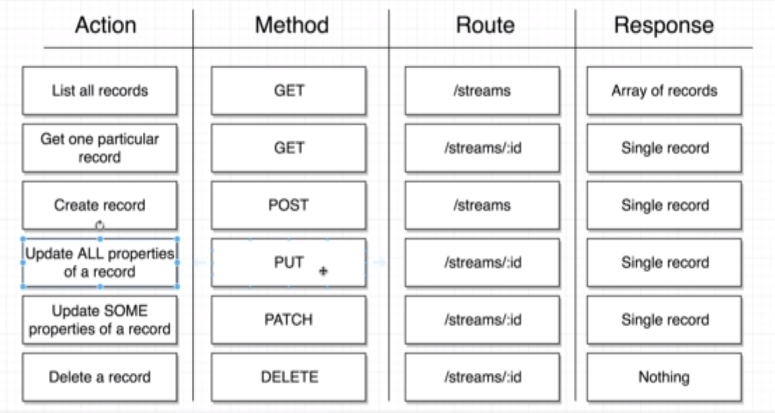

# Portals

* It's difficult to render **modals** with React because all your JSX elements need to be children of `<div id="root">`.
* **Portals** allow you to get around this.
* The problem with modals is that their CSS should guarantee they render on top of all the existing elements, thereby obscuring them.
* However, since a modal element in React can be a very deeply nested child node, CSS styles of parent elements can interfere with this.
* Portals allow you to render JSX elements as a child of body as opposed to `<div id="root">`.

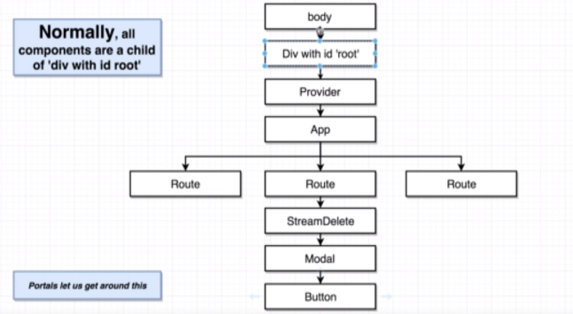

* **When do you use Portals?** When you use modals, or adding content that aren't generated by React.

# React.Fragment

Functions and variables need to be wrapped with a `<div>` when returning JSX.

However this can present CSS styling issues when you have unnecessary divs.

In those instances, you can use React.Fragment to wrap JSX elements.


Example:

```javascript
   const actions = (
      <React.Fragment>
         <button className="ui primary negative">Delete</button>
         <button className="ui button">Cancel</button>
      </React.Fragment>
   );
```


# The React Context System

* The entire purpose of context is to share data from a **parent** with *any* **child**.

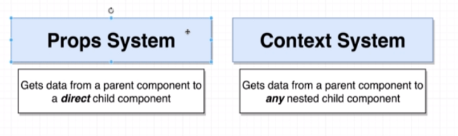


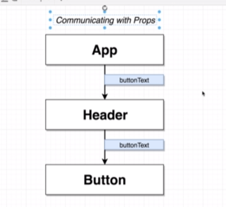


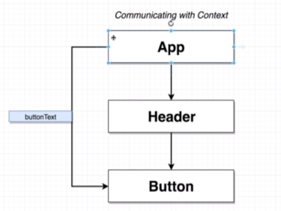


**There are two ways to get information into the context and two ways to get information out:**

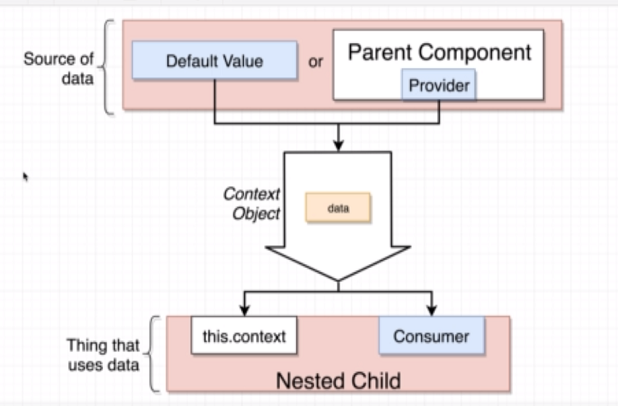


**In the sample context app, the following flow takes place:**

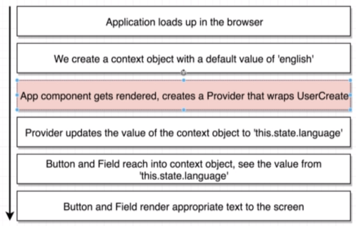

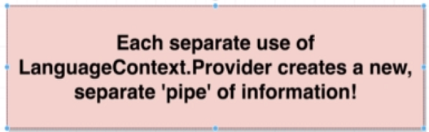


**Example to illustrate this:**

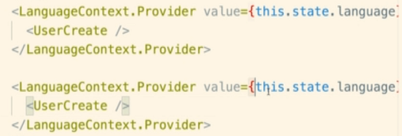


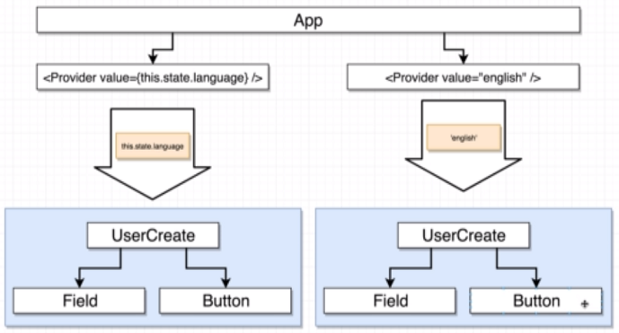

* **When do you use a Consumer over a Provider?**

`When you want to access values from multiple contexts.`


**REDUX VS CONTEXT**

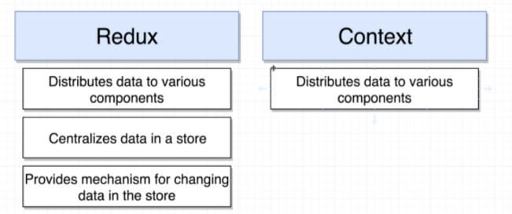

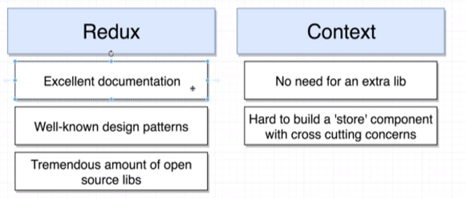


If we want to replace Redux with Context, there are three things to consider.

The first thing in green, is not an issue, but the entire point of Context.

The next two are **issues** of using Context over Redux.

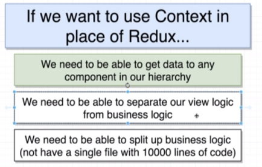

