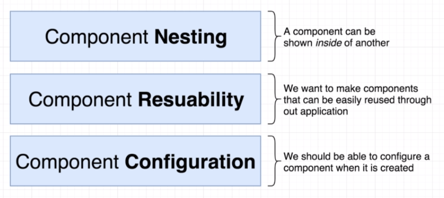
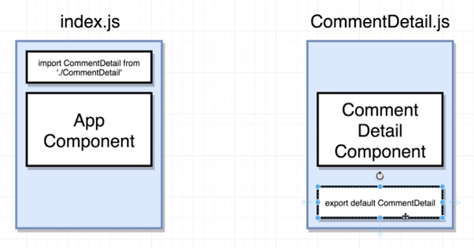
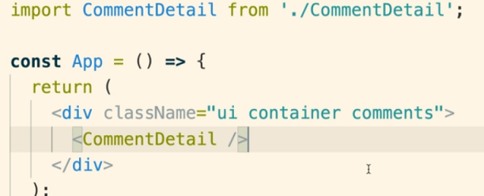
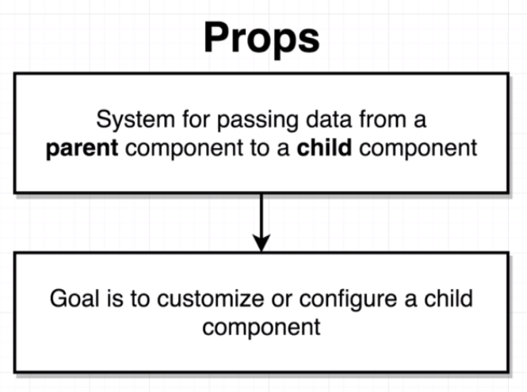
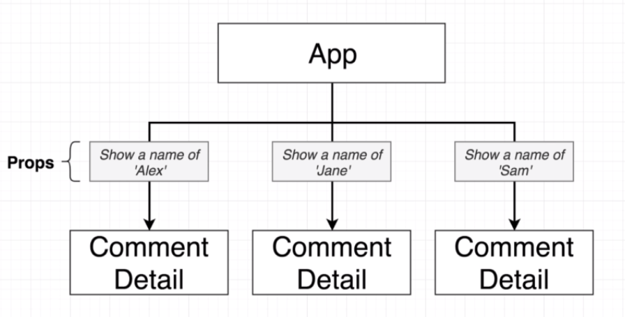
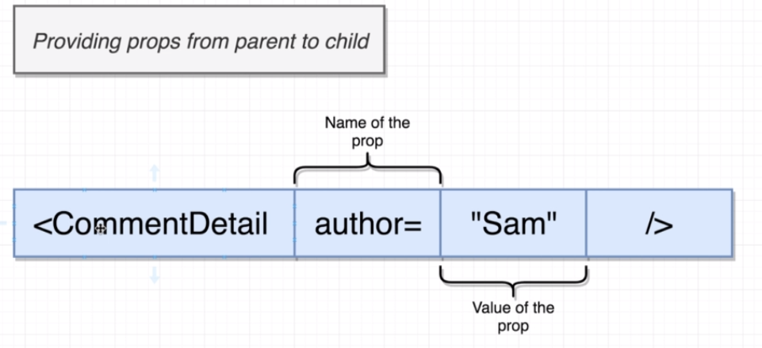
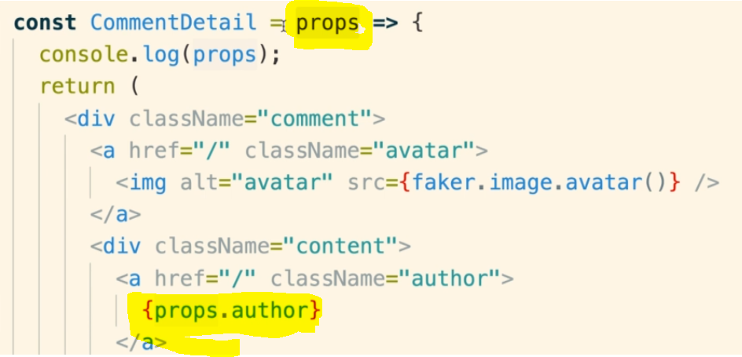
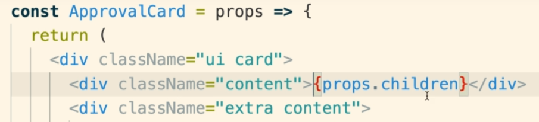

# Section 3 - Communicating with Props

## L26

- Use semantic-ui for CSS boilerplate.
- Search for semantic-ui cdn, to look for the CSS files. Copy the link to the public hosted semantic-ui CSS file.
- In the index.html file, add a <link rel="stylesheet" href="link to semantic.min.css url"> within the header.

## L28

- We need image data for our website. The easiest way to do this is using Faker.js - a library that generates a vast array of fake data - customer data, credit card data as well as images!
- Go to the console and navigate to the root project directory. Then type `npm install --save faker`.
- `--save` indicates you want to save it into your project.
- The GitHub page for FakerJS shows what kind of fake data it can generate. To access fake image avatars in JSX, simply put `{faker.image.avatar()}`.
- Every time you refresh the page, a new avatar image would be generated.

## L30

Steps to create a reusable, configurable component (component names are in upper camel case):

- To import components, you have to add an `export default <name>` to the end of the file you want to be imported.
- Then you can import the file using a relative file path i.e. `import MyFile from './MyFile'`

- When you want to refer to components in JSX, you don't need curly braces - you treat them like HTML tags!

## L31

- For the child component to access the arguments passed to it, you need to define a single argument - by convention it will be called props.
- The parent will pass a JS object of key-value pairs, of all the arguments passed to be passed to the child. E.g.:

(image props child)

## L38

- When you pass a component as an argument to another component in JSX (and not through attributes), the component will be passed into the 'props' object.
- The the component argument value would specifically turn up in the property 'children' in the 'props' object.

