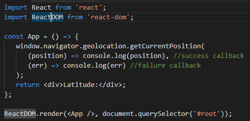

# Section 4 - Structuring Apps with Class-based Components

## L44

- **Functional components** are good for showing _simple_ content to the user, **class components** are good for everything else.
- Responding to user events, network requests, complex logic - use class based components.
- Note that the React community is divided over which component type to favour! Which one is easier is subjective.

## L47

- To find out location information about a user, use the **Geolocation API**:
> developer.mozilla.org/en-US/docs/Web/API/Geolocation_API

## L49

- Geolocation takes time to determine your location!
- As you can see from the flow, we have to *wait* until the geolocation is sent before the page is rendered.
- With a functional component, there's no way to wait until the success callback is returned to update the latitude in the page.
- We need a **class component** to implement the following flow:

## L50

- Note that JavaScript classes are based on Prototyping Inheritance

