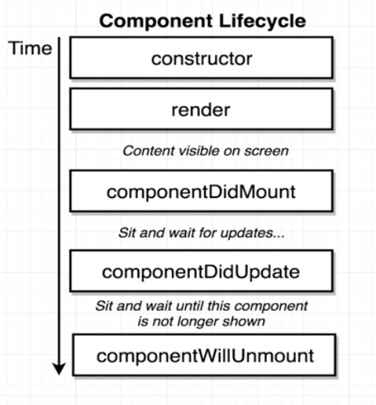
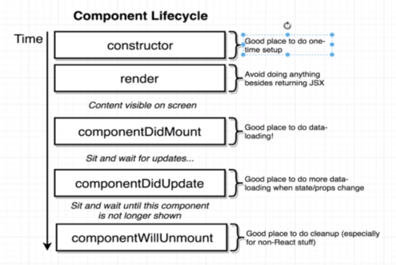
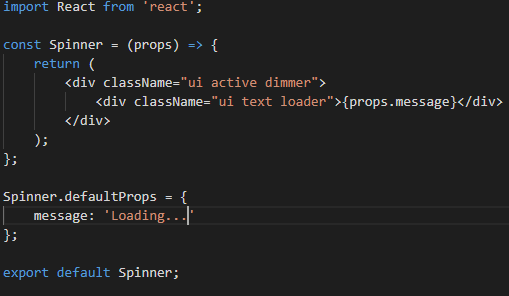

# Section 6 - Understanding Lifecycle Methods

## L57

* A component lifecycle method is a function you can optionally define inside class-based components. *constructor* and *render* are lifecycle methods
you have already used.
* They are executed by React during a **component's lifecycle**.

* **componentDidMount** is called immediately after a component is shown on the browser.
* After that, the component wait for an update. If a component is updated, **componentDidUpdate** is called.
* Note: When a component is updated, **render** is *first* called, then **componentDidUpdate** is called *immediately after*.
* When you want to stop showing a component on the browser, the **componentWillUnmount** method will be called. *Typically used to perform some cleanup after a component.*

## L58

When to use component lifecycle methods:

* The **render** method is ONLY for returning JSX.
* The **componentDidMount** method gets invoked only *one* time, so it's good to do initial data loading here or to kick off another process.
* While the **constructor** and **componentDidMount** can be used to do the same thing, according to the **official best practice**, *do not do data loading in **componentDidMount**.*
* **There are other lifecycle methods, however they are very rarely used, so it is ignored in this course.**

## L59

Using default props:

