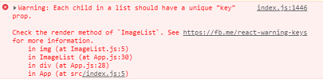
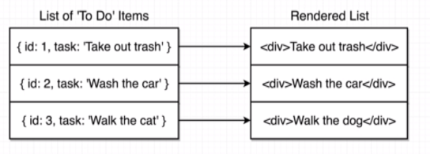
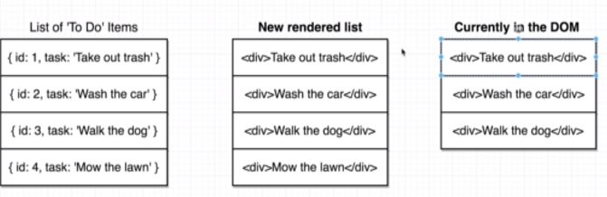
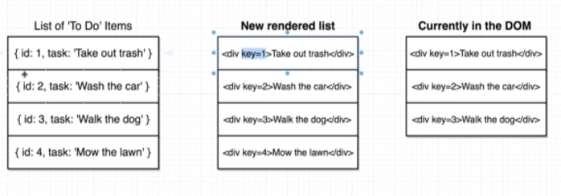
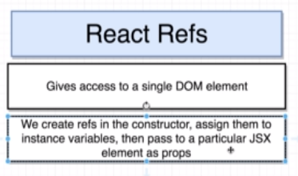

============================
# Section 8 - Fetching Data
============================

## Event Handling
------------------
React does not handle network requests, it is only about manipulating HTML.

There are two commonly used ways of handling network requests and fetching data:

1. **axios** - a 3rd party library, install via npm. *Preferred, more powerful approach to handling network requests.*
2. **fetch** - a function supported by all browsers. *Far more basic and lower level function for network requests.*

================================
# Section 9 - Rendering Lists
================================

In order to render updates to list performantly, you need to supply a **key** with every element in the JSX list.
Otherwise, React returns the following warning:

If you were rendering the following list:

And wanted to add another element to it:

React would have to sequentially compare every element in the exisiting list in the DOM with the new list, in order to determine which one to make an update to. However if you supply a key, this can be done more efficiently:

=========================================
# Section 10 - Acessing the DOM with Refs
=========================================

In the sample image project, getting images to showup nicely as adjacent tiles is difficult to achieve with CSS alone.
Below is the flow of how this can be achieved via React:

In order to access DOM elements, the vanilla JavaScript way of doing it is: `document.querySelector('img')`
In React, this is instead done through its `ref` system.
This is because outside of React, it's difficult to directly access DOM elements that were created by React JSX. So we use the ref system to access those JSX created DOM elements.

