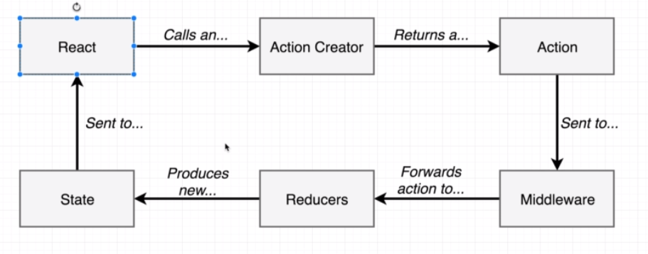
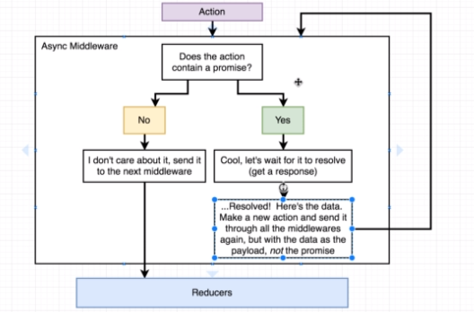
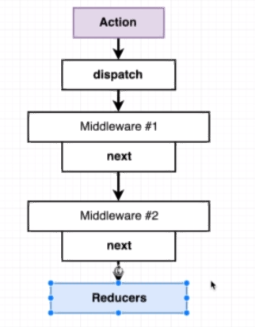

# Middlewares with Redux

## Overview of Redux Flow



## How Async Middleware like thunk or redux-promise work





> Dispatch is what starts the entire chain of middleware in redux.

> So if you want to start the entire action->middleware->store flow again from the middle of an executing middleware, you call dispatch.

## Redux Middleware Signature

```javascript
function middleware({ dispatch, getState }) {
  return function(next) {
    return function(action) {
      // your middlware code!
      // next(action) -> will continue to the next middleware!
      /*
      If you want to run code after the reducer has been updated, continue writing
      statements after next(action).
      If you want to terminate this middleware, just do:
      return next(action)
      */
      //getState -> get the current reducer state
    };
  };
}
```

> Note: The complex signature is by design. Redux creator regrets going with this signature, but won't change because it will break APIs.
