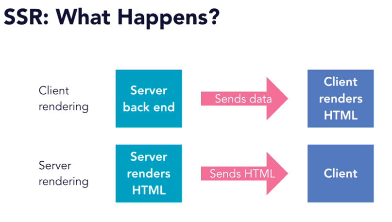

# React: Server Side Rendering

## Introduction

* SSR, Isomorphic and Universal are different terms used to describe the same thing - the application is rendered on the server rather than on the client.




* Large applications will have better performance on a server.
* Performance of application is not dependent on client hardware.
* JavaScript doesn't play as well with search engines - rendered HTML can be parsed better by them.


# First Steps

* We use a library called `Next.JS`, which is an easy to user server side rendering library that works well with  `Redux`.

* **THE OFFICIAL REACT SSR SOLUTION IS ReactDOMServer**

1. Create a new directory.
2. type `npm init`
3. Open VS Studio Code.
4. Create a new `.gitignore` file and add `node_modules` to it.
5. Create a new folder called `pages`, and in it, put your `index.js` file that returns hello world.
6. _If you're using Next.JS, you don't actually need to import React!`.
7. Open the terminal in VS Code, then type `npm install --save next react react-dom`
8. Once installed, go to `package.json` and under `test`, **replace** the default with:
 ```json
 {
    "dev": "next", 
    "build": "next build", 
    "start": "next start"
}
 ```
 9. In the terminal, type `npm run dev`.
 10. In the root folder, create your `static` folder to store static data.
 11. **Next.JS does not come with CSS support out of the box**, so this functionality needs to be added.
 12. Shutdown your dev server. Then type `npm install --save @zeit/next-css`
 13. This needs to be configured, so create a new file in root called `next.config.js`
 14. In it type: 
 ```javascript
 const withCSS = require('@zeit/next-css');
 module.exports = withCSS();
```

## Other Notes

> In order to pass props server side, you need to call the getInitialProps() method. Below are two examples:

```javascript
  //This loads props by calling an API
  // You need to do: npm install --save isomorphic-unfetch
  // import 'isomorphic-unfetch'
  static async getInitialProps () {
    const res = await fetch('https://api.github.com/repos/zeit/next.js')
    const json = await res.json()
    return { stars: json.stargazers_count }
  }

  //This loads props by calling a JSON data file loaded earlier
  //import data from '../data/data.json';

  static async getInitialProps() {
    return { cards: data };
  }
```


> Go to https://github.com/zeit/next.js/tree/master/examples to see examples of various scenarios.

> **To use React with Next.JS, first install:**
`npm install --save redux redux-devtools-extension redux-thunk react-redux next-redux-wrapper`

> You need to import `withRedux from 'next-redux-wrapper'`
