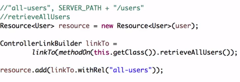
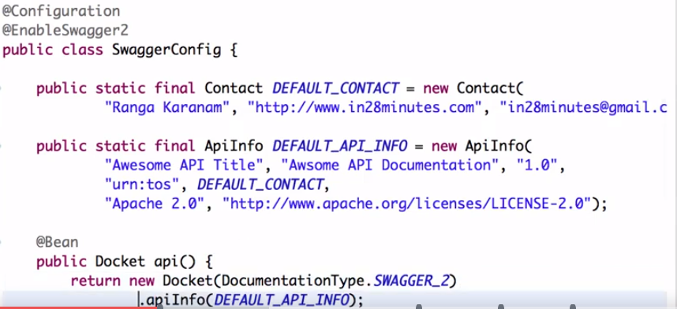
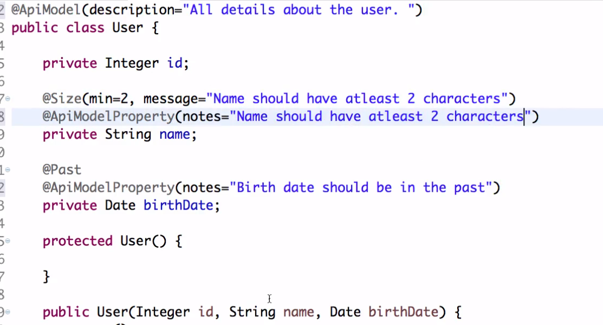
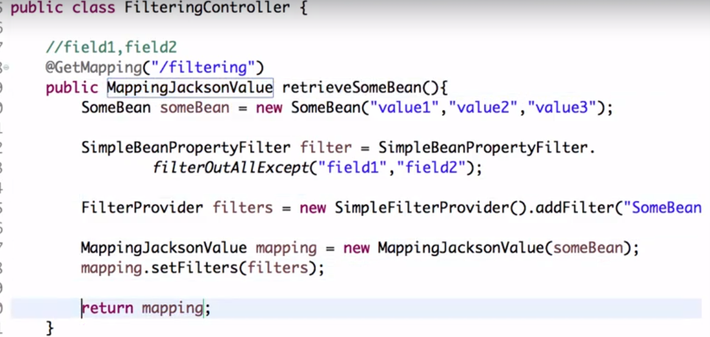
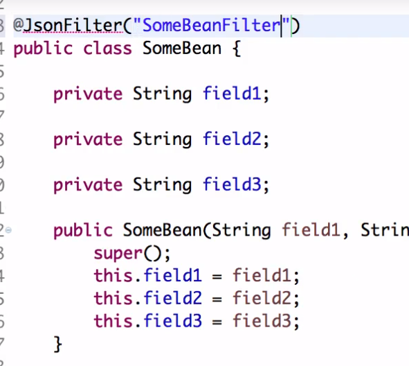
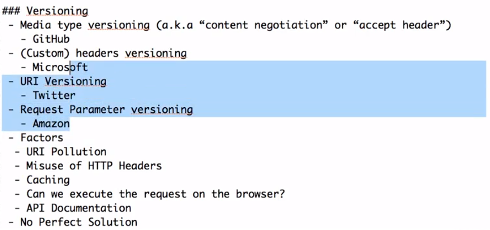

## Spring Boot Advanced Features 

## HATEOAS

* When you request a resource, it may be insufficient to simply return the data that defines the resource.
You may also want to return links that perform further operations on that resource.

* For example, if you look at the repositories associated with a Github account, you may want to: star the repository,
visit the repository, fork the repository, etc.

* HATEOAS - Hypermedia As The Engine Of Application State

### Spring Boot HATEOAS

* We need to include Spring Boot HATEOAS start dependency.
* One way to add links to a resource is to add a hard coded link. However this isn't great, as we need would have to update all the 
hard coded values one day.
* ****Spring Boot's HATEOAS library allows us to construct links using methods**.
* So we will need to expose all the operations on the server that can be done on a resource by creating controllers, etc.
* To construct a HATEOAS resource, we wrap the resource in a HATEOAS `Resource<T>` object.
* To construct a link using controller method names, we use the `ControllerLinkBuilder`.



* `ControllerLinkBuilder.linkTo()` constructs a URL from the given controller method.
* `ControllerLinkBuilder.linkTo.withRel()` adds a name to the resource link, so in the
JSON it will be: `"_links": { "all-users": { "href" : "/url" } }`

## Internalization

* This about customizing the resources returned based on the location of the client.

## Content Negotiation

* When you create a REST webservice and send a generic request, you will get a JSON response.
* However, if you change your request to only accept XML, you will receive a HTTP `406 Not Acceptable` response.
* You can configure your webservice to return different resources based on the request content header.

## Swagger

* Swagger is one of the most popular methods of documenting RESTful webservices.

* To add extra Swagger info, configure the Docket as shown below:



* Adding info to models (definitions):



* Look at the Swagger annotations for RequestHeader and Authorizations.

## Spring Boot Actuator

Provides monitoring services such as:

   - Health check
   - Memory usage
   - Logging
   - Http Trace
   - Scheduled Tasks

**NOTE:** You should only enable only the endpoints you need as it has a performance impact. A lot of the endpoints shouldn't be enabled in PROD due to the performance impact.

## Filtering

### Static Filtering

Say you have a Person object, and you never want its `birthDate` field to be returned.
To do this, add a `@JsonIgnore` annotation to the field:

```java
public class Person {
   firstName;
   lastName;
   @JsonIgnore
   birthDate;
}
```

An alternative way to ignore fields:

```java
@JsonIgnore(value={"lastName", "birthDate"})
public class Person {
   firstName;
   lastName;
   birthDate;
}
```

### Dynamic Filtering



* We have to return a `MappingJacksonValue`.
* We need to create a Filter. The example above uses the `SimpleBeanPropertyFilter` class to generate a specific filter for our needs.
* We instantiate a `MappingJacksonValue` with our `Bean` and set its filter to what we created.
* **IMPORTANT:** A list of *valid filters* must be defined on the bean.




## Versioning


