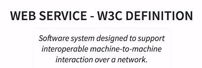
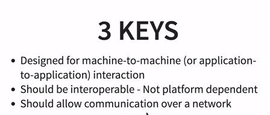
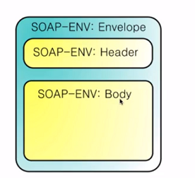
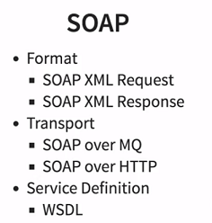
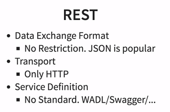
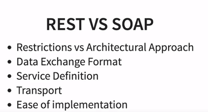

# Introduction

## What is a web service?





* Web services must be platform independent - this is where XML/JSON comes in.
* Web services expose a service definition that describes how to use it.

## SOAP

* A SOAP webservice must adhere to specific XML format.





* SOAP **does not** impose a restriction on your transport - you can use HTTP or MQ.

## REST





## Spring Boot Basics

* When you load Spring Boot, it looks for AutoConfiguration classes. These classes handle a lot functionality.
* An example of this is the Bean to JSON conversion that takes place.
* The dispatchServlet plays a key role in serving requests. It is mapped to some path, and any requests to that path are then mapped to a Controller (if one exists).

* Use `@PathVariable` to use variable in the URL (not the same as an URL Param)
* Use `@PostMapping` to handle POST requests.
* Use `@RequestBody` to a method parameter, to indicate it will hold the body of a POST request.
* A `ResponseEntity` is part of the Spring framework. It's an extension of `HttpEntity`, however you can include a status code.
* You can use `ResponseEntity<T>.created(location)` to return a `201 HTTP Status`. `created` is passed the URI of the resource created.
* You can use `UriComponentBuilder.fromCurrentRequest()` to build URIs dynamically and expand them based on the method they are called from.

## How to implement Custom Exception Handling

The scenario is that you want your own JSON format error response to be sent when an exception occurs.

* You need to first create your Exception message class.
* Then create a customized ExceptionHandler that extends the `ResponseEntityExceptionHandler` abstract class.

```java
@RestController //because this returns a response
@ControllerAdvice //to share it across other controllers. Commonly used for Exceptions, how dates are defined (InitBinder) and common ModelAttributes
public class CustomizedResponseEntityExceptionHandler extends ResponseEntityExceptionHandler {

   @ExceptionHandler(Exception.class) //Handles all exceptions - can be made more specific
   public final ResponseEntity<Object> handleAllException(Exception ex, WebRequest request) {
      ExceptionResponse er = new ExceptionResponse(new Date(), ex.getMessage());
      //ExceptionResponse is the JSON class you defined

      return new EntityResponse(er, HttpStatus.INTERNAL_SERVER_ERROR);
   }

      @ExceptionHandler(NotFoundException.class) //Handles all exceptions - can be made more specific
      public final ResponseEntity<Object> handleNotFoundException(Exception ex, WebRequest request) {
         ExceptionResponse er = new ExceptionResponse(new Date(), ex.getMessage());
         //ExceptionResponse is the JSON class you defined

         return new EntityResponse(er, HttpStatus.INTERNAL_SERVER_ERROR);
   }
}
```

## Easy Bean Validation

* You can use the Java validation API to use annotations to validate fields.
* Dependencies are the Java validation API, and the Hibernate implementation of it.
* You will need to customize exception handling for this. You also need to use `ex.RequestBinding()` to loop through all the errors and only get what you want.

```java
public class Eg {
   @Size(min=2, message="Name should be at least 2 chars")
   private String name;

   @Past(message="Birthdate must be before today")
   private Date birthDate;

   @Pattern(regexp = "[a-zA-Z0-9]", message="needs to be alphanumeric")
   private String description;
}
```

**MUST READ:**
> https://github.com/OWASP/CheatSheetSeries/blob/master/cheatsheets/Bean_Validation_Cheat_Sheet.md
> https://docs.jboss.org/hibernate/validator/5.2/reference/en-US/html/ch02.html#table-custom-constraints