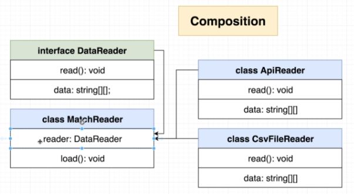
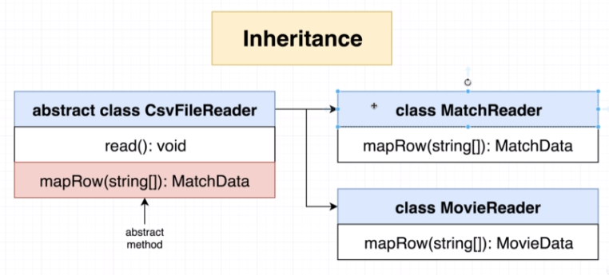
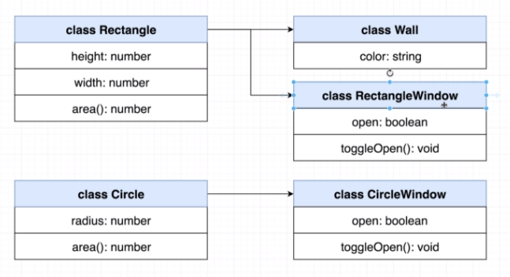
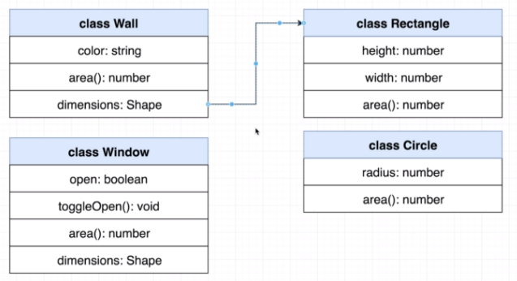

# Composition and Inheritance

Inheritance is characterized by an "IS-A" relationship.

Composition is characterized by a "HAS-A" relationship.

## Example

## How to model a Window, and later a Circular Window

### Inheritance

Note the code duplication.

## Composition

The dimensions attribute could reference a `Rectangle` or a `Circle`.

## A Huge Misconception about Composition

- Many people think about composition as extending the properties of an object with another object. **This is INCORRECT**.
- **Composition** should be achieved via _delegating_ behaviour to other objects.
